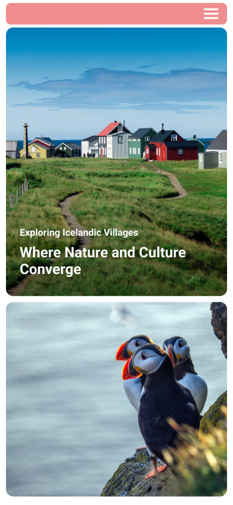

# EN - Engeto.cz - Homework - Lesson 3.2 Responsive Web Design II.

## Description

The bonus task is designed to review what we learned during the previous lesson **3.2: Responsive Web Design II** at the [Engeto Front-end Developer Academy](https://engeto.cz/webova-akademie/). Complete the task in VS Code, and you can check it against the reference solution below at the end:

### Reference HTML Solution

```html
<!DOCTYPE html>
<html lang="en">
  <head>
    <meta charset="UTF-8" />
    <meta name="viewport" content="width=device-width, initial-scale=1.0" />
    <title>Document</title>
    <link rel="preconnect" href="https://fonts.googleapis.com" />
    <link rel="preconnect" href="https://fonts.gstatic.com" crossorigin />
    <link
      href="https://fonts.googleapis.com/css2?family=Inter:wght@400;500;700&family=Roboto&display=swap"
      rel="stylesheet"
    />
    <link rel="stylesheet" href="styles.css" />
  </head>
  <body>
    <nav>
      <a href="">Home</a>
      <a href="">About Us</a>
      <a href="">Explore</a>
      <a href="">Contact Us</a>
      <div class="icon"></div>
    </nav>
    <div class="hero-section">
      <div class="hero-text">
        <div class="hero-subtitle">Exploring Icelandic Villages</div>
        <h1 class="hero-title">Where Nature and Culture Converge</h1>
      </div>
    </div>
    <div class="image-container">
      
    </div>
  </body>
</html>
```

### Reference CSS Solution

```css
* {
  margin: 0;
  padding: 0;
  box-sizing: border-box;
}

body {
  margin: 16px 32px;
  font-family: 'Roboto', sans-serif;
}

@media (max-width: 768px) {
  body {
    margin: 8px;
  }
}

nav {
  background-color: #f08d8f;
  display: flex;
  justify-content: space-evenly;
  border-radius: 8px;
  margin-bottom: 10px;
}

nav a {
  text-decoration: none;
  padding-top: 16px;
  padding-bottom: 16px;
  color: #fff;
  font-size: 20px;
  font-weight: bold;
}

.icon {
  width: 30px;
  height: 25px;
  display: none;
  padding: 8px;
  margin-left: auto;
}

.icon img {
  width: 100%;
  height: 100%;
}

@media screen and (max-width: 768px) {
  .icon {
    display: block;
  }
  nav a {
    display: none;
  }
}

.hero-section {
  height: 70vh;
  background-image: url('https://shorturl.at/jmX23');
  background-size: cover;
  background-position: center;
  background-repeat: no-repeat;
  border-radius: 12px;
  margin-bottom: 24px;
  position: relative;
}

.hero-text {
  position: absolute;
  bottom: 16px;
  left: 32px;
  color: #fff;
}

.hero-subtitle {
  font-size: 20px;
}

@media (max-width: 768px) {
  .hero-subtitle {
    font-size: 18px;
  }
}

.hero-title {
  margin-top: 8px;
}

@media (max-width: 768px) {
  .hero-title {
    font-size: 24px;
  }
}

.image-container {
  width: 50%;
}

@media (max-width: 768px) {
  .image-container {
    width: 100%;
  }
}

.image-container img {
  width: 100%;
  height: 100%;
  border-radius: 12px;
}
```

The task was to create a simple responsive page with a hero section and an image. The page should look like the example below for both desktop and mobile.

### Desktop Version Preview 🖥️ :


### Mobile Version Preview 📲 :



<hr>

# CZ - Engeto.cz - Domácí úkol - lekce 3.2 Responzivní webdesign II.

## Popis

Bonusový úkol slouží k zopakování toho, co jsme se naučili během dosavadní lekce <b>3.2: Responzivní web design II.</b> v <a href="https://engeto.cz/webova-akademie/">Engeto Front-end Developer Akademii</a>. Úkol vypracujte ve VS Code a můžete si ho na konci zkontrolovat s referenčním řešením níže:

### Referenční řešení HTML

```html
<!DOCTYPE html>
<html lang="en">
  <head>
    <meta charset="UTF-8" />
    <meta name="viewport" content="width=device-width, initial-scale=1.0" />
    <title>Document</title>
    <link rel="preconnect" href="https://fonts.googleapis.com" />
    <link rel="preconnect" href="https://fonts.gstatic.com" crossorigin />
    <link
      href="https://fonts.googleapis.com/css2?family=Inter:wght@400;500;700&family=Roboto&display=swap"
      rel="stylesheet"
    />
    <link rel="stylesheet" href="styles.css" />
  </head>
  <body>
    <nav>
      <a href="">Home</a>
      <a href="">About Us</a>
      <a href="">Explore</a>
      <a href="">Contact Us</a>
      <div class="icon"></div>
    </nav>
    <div class="hero-section">
      <div class="hero-text">
        <div class="hero-subtitle">Exploring Icelandic Villages</div>
        <h1 class="hero-title">Where Nature and Culture Converge</h1>
      </div>
    </div>
    <div class="image-container">
      
    </div>
  </body>
</html>
```

### Referenční řešení CSS

```css
* {
  margin: 0;
  padding: 0;
  box-sizing: border-box;
}

body {
  margin: 16px 32px;
  font-family: 'Roboto', sans-serif;
}

@media (max-width: 768px) {
  body {
    margin: 8px;
  }
}

nav {
  background-color: #f08d8f;
  display: flex;
  justify-content: space-evenly;
  border-radius: 8px;
  margin-bottom: 10px;
}

nav a {
  text-decoration: none;
  padding-top: 16px;
  padding-bottom: 16px;
  color: #fff;
  font-size: 20px;
  font-weight: bold;
}

.icon {
  width: 30px;
  height: 25px;
  display: none;
  padding: 8px;
  margin-left: auto;
}

.icon img {
  width: 100%;
  height: 100%;
}

@media screen and (max-width: 768px) {
  .icon {
    display: block;
  }
  nav a {
    display: none;
  }
}

.hero-section {
  height: 70vh;
  background-image: url('https://shorturl.at/jmX23');
  background-size: cover;
  background-position: center;
  background-repeat: no-repeat;
  border-radius: 12px;
  margin-bottom: 24px;
  position: relative;
}

.hero-text {
  position: absolute;
  bottom: 16px;
  left: 32px;
  color: #fff;
}

.hero-subtitle {
  font-size: 20px;
}

@media (max-width: 768px) {
  .hero-subtitle {
    font-size: 18px;
  }
}

.hero-title {
  margin-top: 8px;
}

@media (max-width: 768px) {
  .hero-title {
    font-size: 24px;
  }
}

.image-container {
  width: 50%;
}

@media (max-width: 768px) {
  .image-container {
    width: 100%;
  }
}

.image-container img {
  width: 100%;
  height: 100%;
  border-radius: 12px;
}
```

Úkolem bylo vytvořit jednoduchou responzivní stránku s hero sekci a obrázkem. Stránka by měla pro desktop a mobil vypadat jako na příkladu níže.

### Náhled DESKTOP verze 🖥️ :


### Náhled MOBILNÍ verze 📲 :


